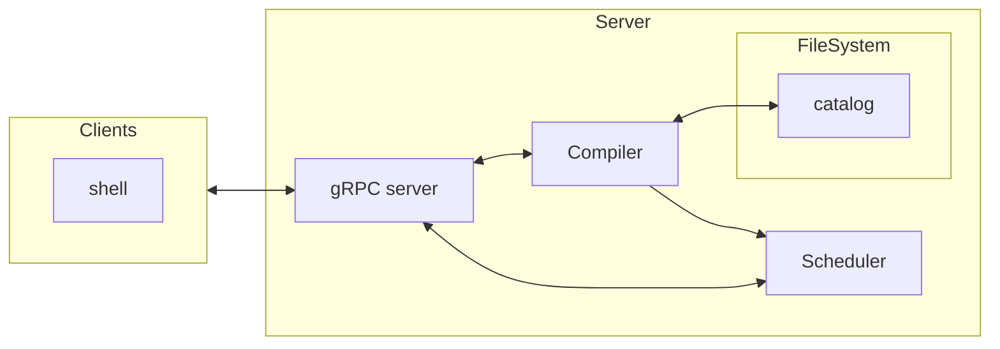
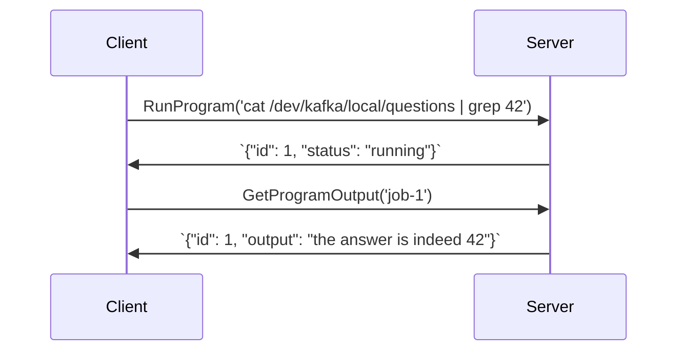

# Components

An overview of the components that make up `TypeStream`.

## Overview

`TypeStream` transforms bash-like code into typed data pipelines and then runs them
for you. In order to that, it needs a few components:

- A [gRPC server](#grpc-server). It's how you compile and run programs with
  `TypeStream`.
- A `virtual filesystem`. It's how TypeStream allows you to address data sources
  with a familiar path-like syntax. The [FileSystem](virtual-filesystem.md) document
  explains in more details how it works.
- A `data catalog` that makes sense of the data schemas. It's how `TypeStream`
  type checks your programs.
- A `compiler`. The server uses it to compile source code in a generic graph
  which is then resolved by the resolvers.
- A `scheduler`. Streaming data pipelines are mostly long running jobs so the
  TypeStream scheduler makes sense of the data pipelines (via their assigned
  runtime, e.g. kafka streams) and schedules them accordingly.
- `shell` - The official shell like program. It's the only official gRPC client
  at the moment. See the [getting started](/getting-started.mdx) guide for more
  information.

Since there's a lot of moving parts, it's useful to have a diagram that shows
they're connected:



## gRPC Server

At its core, `TypeStream` is a remote compiler. Clients send code to a server,
the server turns the code into data pipelines and runs them via a scheduler. At
a very high-level, the client/server interaction works this way:

- Clients sends source code via gRPC calls to the server.
- The server compiles the source code into a program and returns structured
  information about the program back to the client. (e.g. the program id,
  information about the output data streams, etc.)
- The client reacts accordingly.

A core principle behind the design of `TypeStream` is the idea clients maintain
minimal state. The process of compiling source code into runnable data pipelines
has many moving parts so the clients are simple enough they're almost only
"rendering" results and informing their users.

Before we dive deeper into the details of how the compilation process works,
it's useful to look at some examples of the various requests clients can issue
to a `TypeStream` server:

```sh
ls # one stmt + no data = shell program, outputs things

cd connectors # one stmt + no data = shell program, changes env

man ls # one stmt + no data = shell program, outputs things

ls topics # one stmt + no data = shell program, outputs things

grep 42 answers # one stmt + data = streaming program, continuously outputs things

cat answers | grep 42 | grep 24 # one stmt + data = streaming program, continuously outputs things
```

From the examples we can conclude the following:

- Source code may be compiled down to a shell command or data program.
- The program may be a background job.
- The program may have output.
- The program may continuously output data.

The server exposes a few gRPC services.

Let's have a look at the most common scenario so we can discuss the various
services in context:



## Compiler

The compiler is `TypeStream` core as it's where code become typed data pipelines.

You can think of as a function that takes a string (the source code) and returns
a generic Graph representation of the data pipeline. Here's an high-level
step-by-step overview of the compilation process:

1. The scanner converts the source code into tokens.
2. The parsers converts tokens into AST (abstract syntax tree).
3. The semantic analyzer type checks the data pipeline and enriches the AST and
   with type information, producing an "enhanced AST".
4. The compiler packages the "enhanced AST" into a program (list of statements +
   graph data pipeline).

Steps 1, 2, and 4 are pretty standard in most compilers. Step 3 is where `TypeStream`
does most unique work so let's focus on that.

In order to explain how the semantic analyser works, it's useful to have an
example at hand that showcases crucial features of the language:

```sh
let authors = "/dev/kafka/local/topics/authors"

let books = "/dev/kafka/local/topics/books"

let ratings = "/dev/kafka/local/topics/ratings"

cat $authors | grep "Mandel" > /dev/kafka/local/topics/authors_mandel

cd /dev/kafka/local/topics

cat $books | cut $title > book_titles

join books /dev/kafka/local/topics/book_titles > /dev/kafka/local/topics/ratings_with_titles
```

The semantic analyser primary job is to make sense of the data streams types
involved in the data pipeline. There are two reasons why this is important:

- To correctly infer the sink nodes types (the redirections).
- To apply [encoding rules](schema-propagation.md#encoding-rules) for each sink node.

Take the following statement from the previous example:

```sh
cat $authors | grep "Mandel" > /dev/kafka/local/topics/authors_mandel
```

the semantic analyser assigns to the output topic the same type and encoding as
the authors topic since the pipeline isn't changing the type of input the data
stream and only one encoding is involved.

Now consider the following statement:

```sh
cat $books | cut $title > book_titles
```

In this case, the semantic analyser assigns the type Struct[title: String] to
the output topic with a JSON encoding (following the [encoding rules](schema-propagation.md#encoding-rules)).

There is one more detail to consider which concerns variables. Consider this
statement one more time:

```sh
cat $books | cut $title > book_titles
```

The semantic analyser needs to resolves the types of the variables involved
_before_ it can infer the correct type for the output topic because only when
variables are bound the semantic analyser can apply inference rules to the
pipelines.

With these details in mind, let's recap what the semantic analyser does:

- It binds variables.
- It infers the resulting type of the sink nodes (the redirections) from the
  pipeline.
- It applies [encoding rules](schema-propagation.md#encoding-rules) to the sink nodes.

## Scheduler

The scheduler is responsible for running data pipelines. It decides how to run
the pipelines based on the runtime assigned to the program and the "mode" the
server is running in.

## Data Catalog

The data catalog is strongly related to the FileSystem. Since in TypeStream we
address data sources filesystem's like paths, it's only natural that the data
catalog uses the same approach to storing metadata information about the data
sources.

For more information about the data catalog, see the [catalog](schema-propagation.md)

## Filesystem

The Filesystem component is responsible for managing the data catalog and for
maintaining a structured view of the data sources where each data source is
addressed with a filesystem like path. For more information about the
filesystem, see the [filesystem](virtual-filesystem.md) document.

### Watchers

In order to maintain a fresh view of the data sources, the Filesystem component
starts a "watcher" coroutine for each source. Each top level directory has its
own coroutine "watcher" that polls for updates and keeps the info fresh for the
FileSystemService.
