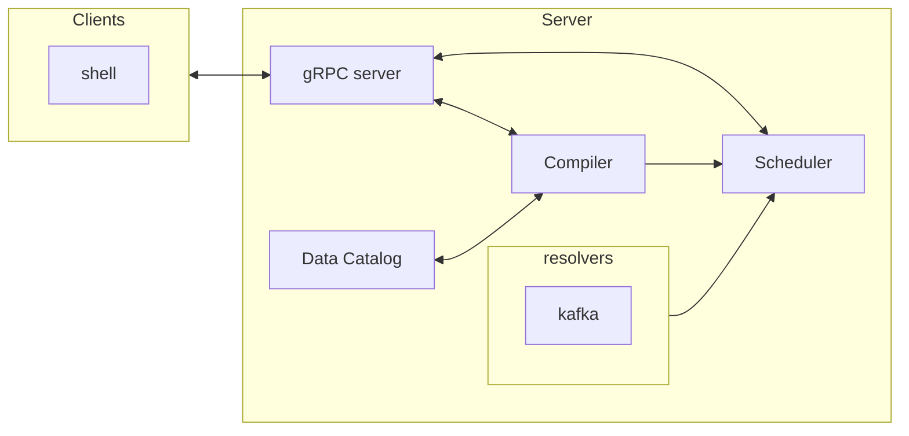
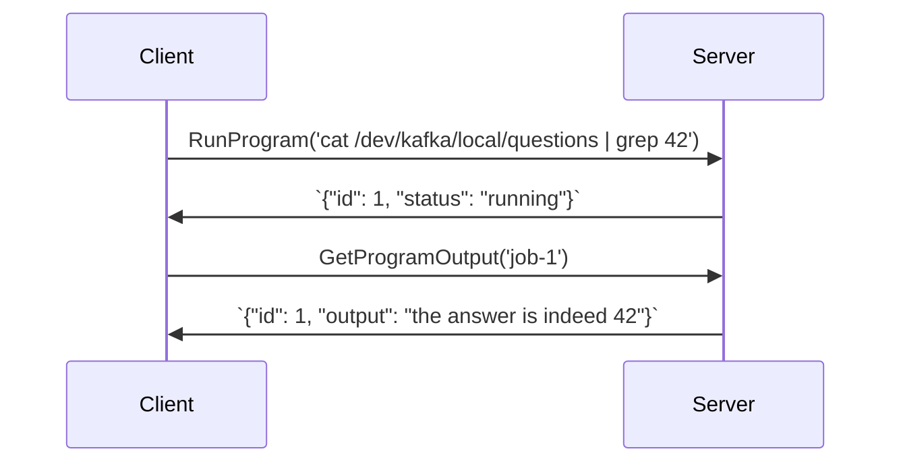

# Components

An overview of the components that make up `TypeStream`.

## Overview

`TypeStream` transforms bash-like code into typed data pipelines and then runs them
for you. In order to that, it needs a few components:

- A [gRPC server](#grpc-server). It's how you compile and run programs with
  `TypeStream`.
- A virtual filesystem. It's how `TypeStream` allows you to address data sources with
  a familiar path-like syntax. The [FileSystem](filesystem.md) document explains
  in more details how it works.
- A data catalog that makes sense of the data schemas. It's how `TypeStream` type
  checks your programs.
- A `compiler`. The server uses it to compile source code in a generic graph
  which is then resolved by the resolvers.
- A `resolver` for each supported [source](/reference/glossary.md#source):
  - A Kafka Streams application resolver which translates the generic graph into
    a runnable kafka streams application.
- A job scheduler.
- `shell` - The official shell like program. It's the only official gRPC client
  at the moment. See the [getting started](/getting-started.md) guide for more
  information.

Since there's a lot of moving parts, it's useful to have a diagram that shows
they're connected:



## gRPC Server

At its core, `TypeStream` is a remote compiler. Clients send code to a server which
the server turns into data pipelines. At a very high-level, the client/server
interaction works this way:

- Clients sends source code via gRPC calls to the server.
- The server compiles the source code into a program and returns structured
  information about the program back to the client.
- The client reacts accordingly.

A core principle behind the design of `TypeStream` is the idea clients should
maintain minimal state. The process of compiling source code into runnable data
pipelines has many moving parts so the clients are simple enough they're almost
only "rendering" results.

Before we dive deeper into the details of how the compilation process works,
it's useful to look at some examples of the various requests clients can issue
to a `TypeStream` server:

```sh
ls # one stmt + no data = shell program, outputs things

cd connectors # one stmt + no data = shell program, changes env

man ls # one stmt + no data = shell program, outputs things

ls topics # one stmt + no data = shell program, outputs things

grep 42 answers # one stmt + data = streaming program, continuously outputs things

cat answers | grep 42 | grep 24 # one stmt + data = streaming program, continuously outputs things
```

From the examples we can conclude the following:

- Source code may be compiled down to a shell command or data program.
- The program may be a background job.
- The program may have output.
- The program may continuously output data.

The server exposes a few gRPC services.

Let's have a look at the most common scenario so we can discuss the various
services in context:



## Compiler

The compiler is `TypeStream` core as it's where code become typed data pipelines.

You can think of as a function that takes a string (the source code) and returns
a generic Graph representation of the data pipeline. Here's an high-level
step-by-step overview of the compilation process:

1. The scanner converts the source code into tokens.
2. The parsers converts tokens into AST (abstract syntax tree).
3. The semantic analyser type checks the data pipeline and in the process.
   enriches the AST and with type information, producing an "enhanced AST".
4. The compiler packages the "enhanced AST" into a program (list of statements +
   graph data pipeline).

Steps 1, 2, and 4 are pretty standard in most compilers. Step 3 is where `TypeStream`
does most unique work so let's focus on that.

In order to explain how the semantic analyser works, it's useful to have an
example at hand that showcases crucial features of the language:

```sh
let authors = "/dev/kafka/local/topics/authors"

let books = "/dev/kafka/local/topics/books"

let ratings = "/dev/kafka/local/topics/ratings"

cat $authors | grep "Mandel" > /dev/kafka/local/topics/authors_mandel

cd /dev/kafka/local/topics

cat $books | cut $title > book_titles

join books /dev/kafka/local/topics/book_titles > /dev/kafka/local/topics/ratings_with_titles
```

The semantic analyser primary job is to make sense of the data streams types
involved in the data pipeline. There are two reasons why this is important:

- To correctly infer the sink nodes types (the redirections).
- To apply [encoding rules](#encoding-rules) for each sink node.

Take the following statement from the previous example:

```sh
cat $authors | grep "Mandel" > /dev/kafka/local/topics/authors_mandel
```

the semantic analyser assigns to the output topic the same type and encoding as
the authors topic since the pipeline isn't changing the type of input the data
stream and only one encoding is involved.

Now consider the following statement:

```sh
cat $books | cut $title > book_titles
```

In this case, the semantic analyser assigns the type Struct[title: String] to
the output topic with a JSON encoding (following the [encoding
rules](#encoding-rules)).

There is one more detail to consider which concerns variables. Consider this
statement one more time:

```sh
cat $books | cut $title > book_titles
```

The semantic analyser needs to resolves the types of the variables involved
_before_ it can infer the correct type for the output topic because only when
variables are bound the semantic analyser can apply inference rules to the
pipelines.

With these details in mind, let's recap what the semantic analyser does:

- It binds variables.
- It infers the resulting type of the sink nodes (the redirections) from the pipeline.
- It applies [encoding rules](#encoding-rules) to the sink nodes.

## Scheduler

TODO: fix this is not accurately described.

The job scheduler schedules the job and sends it to the kafka streams
application resolver that creates and runs a Kafka streams application.

## Data Catalog

The `TypeStream` data catalog is a key-value store where:

- The key is a path to a data stream. Examples: `/dev/kafka/local/topics/users`,
  `/dev/dataflow/cluster1/topics/clicks`.
- The value is a [DataStream](reference/language/specs.md#data-stream).

A DataStream holds:

- Its reference path (which is used to derive identifiers)
- Schema information. For example, `/dev/kafka/local/topics/users` may be a
  `Struct[id: String, name: String, createdAt: Date]`

The compiler uses the data catalog to "type check" source code.

The data catalog is also used to determine the output type of streaming
operations that involve more than one DataStream. See the [DataStream
type](reference/language/specs.md#data-stream) documentation for more
information.

## Encoding rules

`TypeStream` needs to distinguish between different data stream types and their
encodings. The former is part of the typing system of the language, while the
latter is relevant when reading data from sources and writing data back.

Here are the rules that determine the output data stream encoding:

- If the output data stream type is the same as the input data stream type, the
  output data stream encoding is the same as the input data stream encoding.
- If the output data stream type is different from the input data stream type,
  then we default to JSON encoding.

Consider the following data streams:

```sh
let authors = "/dev/kafka/local/topics/authors" # Struct[id: String, name: String] encoded as Avro
let books = "/dev/kafka/local/topics/books" # Struct[id: String, title: String] encoded as Avro
let ratings = "/dev/kafka/local/topics/ratings" # Struct[bookId: String, userId: String, rating: Int] encoded as JSON
```

The following pipeline:

```sh
cat books | grep "Station eleven" > station_books
```

will be encoded as Avro since:

- The input data stream type is Avro encoded.
- The output data stream type is the same as the input one.

While the following pipeline:

```sh
cat books | cut title > book_titles
```

will be encoded as JSON since:

- The input data stream type is Avro encoded.
- The output data stream type is different from the input one.

Also the following pipeline:

```sh
join books ratings > book_ratings
```

will be encoded as JSON since:

- One input data stream type is Avro encoded.
- One input data stream type is JSON encoded.
- The output data stream type is different from the input one.

## Filesystem

### Watchers

Each top level directory has its own coroutine "watcher" that polls for updates
and keeps the info fresh for the FileSystemService.
