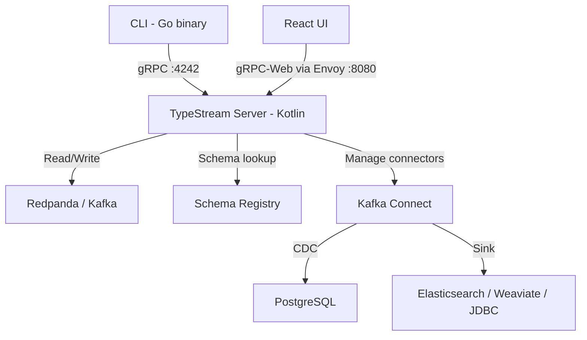

# How TypeStream Works

TypeStream compiles pipeline definitions into [Kafka Streams](https://kafka.apache.org/documentation/streams/) topologies. Whether you define a pipeline through the CLI, a config file, or the visual GUI, the same compilation and execution engine processes it.

## System overview

**Data path**: Sources (Kafka topics, CDC) -> Server compiles pipeline -> Kafka Streams topology -> Sinks (Kafka topics, databases, search indexes)

**Control path**: UI/CLI -> gRPC -> Server -> compiles, schedules, and monitors jobs

## What happens when you create a pipeline

### 1. Definition

You define a pipeline through one of three entry points:

- **CLI DSL**: Text like `grep /dev/kafka/local/topics/books "Station" > /dev/kafka/local/topics/filtered`
- **Config-as-code**: A `.typestream.json` file with a graph of nodes and edges
- **GUI**: A visual graph built by dragging nodes on a canvas

### 2. Compilation

All three paths converge on a validated `Graph<Node>`:

- **Text path** (CLI): `Lexer -> Parser -> AST -> Interpreter -> Graph<Node>`
- **Proto path** (config-as-code and GUI): `PipelineGraph proto -> GraphCompiler -> Graph<Node>`

During compilation, TypeStream resolves schemas from Schema Registry and runs `inferOutputSchema()` on each node. This catches configuration errors (like referencing a field that doesn't exist) before any Kafka resources are allocated.

### 3. Scheduling

The `Scheduler` receives the compiled program and creates a `KafkaStreamsJob`:

1. Walks the node graph and maps each node to Kafka Streams operators
2. Starts a `KafkaStreams` instance with the built topology
3. Tracks job state: `STARTING -> RUNNING -> STOPPING -> STOPPED` (or `FAILED`)

### 4. Execution

The Kafka Streams topology runs continuously, processing records as they arrive. Output is written to the configured sink topics. A `-stdout` topic captures output for streaming results back to the CLI or UI.

### 5. Persistence

Named pipelines (from config-as-code or GUI) are persisted to a Kafka compacted topic (`__typestream_pipelines`). On server restart, all pipelines are automatically recovered and restarted.

## Key components

| Component | Purpose |
|-----------|---------|
| **Redpanda** | Kafka-compatible broker + Schema Registry |
| **TypeStream Server** | Kotlin application: compiler, scheduler, gRPC services |
| **Envoy** | gRPC-Web proxy (enables browser-to-server communication) |
| **Kafka Connect** | Debezium CDC source + JDBC/Weaviate/Elasticsearch sinks |
| **Go CLI** | Local dev environment, interactive shell, pipeline management |
| **React UI** | Visual graph builder, job dashboard, connection management |
