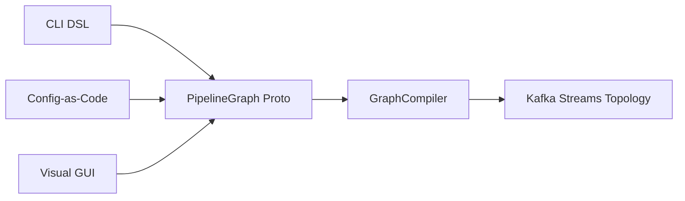

# Three Ways to Build Pipelines

TypeStream offers three interfaces for building data pipelines. All three compile down to the same `PipelineGraph` proto and execute on the same Kafka Streams engine -- they differ only in how you define the pipeline.



## CLI (Interactive Shell)

The TypeStream shell is a REPL with Unix-style syntax. Topics are paths, pipelines are pipes.

```bash
# Start the shell
typestream

# Filter a topic
grep /dev/kafka/local/topics/web_visits "US"

# Pipe to a new topic
grep /dev/kafka/local/topics/web_visits "US" > /dev/kafka/local/topics/us_visits

# Chain operators
cat /dev/kafka/local/topics/web_visits | grep [.status_code > 399] | wc
```

**When to use it**: Exploring data, quick ad-hoc queries, debugging. The shell gives you instant feedback -- type a pipeline, see results immediately. You can also run one-shot commands by piping into the CLI:

```bash
echo 'grep /dev/kafka/local/topics/web_visits [.status_code == 200]' | typestream
```

**How it works**: The DSL goes through `Lexer -> Parser -> Interpreter -> Graph<Node>`. The Interpreter also emits a `PipelineGraph` proto via `PipelineGraphEmitter` when the pipeline is serializable.

## Config-as-Code

Define pipelines as `.typestream.json` files and manage them with `apply`, `plan`, and `validate` commands -- similar to Terraform or Kubernetes manifests.

```json
{
  "name": "webvisits-ok",
  "version": "1",
  "description": "Filter web visits to successful requests",
  "graph": {
    "nodes": [
      {
        "id": "source-1",
        "kafkaSource": {
          "topicPath": "/local/topics/web_visits",
          "encoding": "AVRO"
        }
      },
      {
        "id": "filter-1",
        "filter": {
          "expression": ".status_code == 200"
        }
      },
      {
        "id": "sink-1",
        "kafkaSink": {
          "topicName": "web_visits_ok"
        }
      }
    ],
    "edges": [
      { "fromId": "source-1", "toId": "filter-1" },
      { "fromId": "filter-1", "toId": "sink-1" }
    ]
  }
}
```

Workflow:

```bash
# Validate the file
typestream validate webvisits-us.typestream.json

# Preview changes (like terraform plan)
typestream plan webvisits-us.typestream.json

# Apply the pipeline
typestream apply webvisits-us.typestream.json

# List all managed pipelines
typestream pipelines list

# Delete a pipeline
typestream pipelines delete webvisits-us
```

`plan` accepts a directory to diff multiple pipelines at once:

```bash
typestream plan ./pipelines/
```

**When to use it**: Production pipelines, version-controlled definitions, CI/CD workflows. Pipelines are persisted to a Kafka compacted topic and automatically recovered on server restart.

**How it works**: The CLI parses the JSON file, extracts the `PipelineGraph` proto, and sends it to the server via gRPC (`PipelineService.ApplyPipeline`). The server's `GraphCompiler` converts the proto directly to `Graph<Node>`.

## Visual GUI

The React-based graph builder lets you drag nodes from a palette, connect them on a canvas, and submit the pipeline with one click.

**Node palette categories**:
- **Sources**: Kafka Source, Postgres Source (CDC)
- **Transforms**: Filter, GeoIP, Text Extractor, Embedding Generator, OpenAI Transformer
- **Sinks**: Kafka Sink, Inspector, Materialized View
- **Database/Vector Sinks**: Populated dynamically from configured connections (PostgreSQL, MySQL, Weaviate, Elasticsearch)

**Key features**:
- Real-time schema inference as you build -- field names appear on edges
- Live data preview via Inspector nodes
- Throughput sparklines on the job detail page
- Database connection management with health monitoring

**When to use it**: Visual pipeline design, exploring unfamiliar data, demos, and when you want schema validation feedback as you build.

**How it works**: The React Flow graph is serialized to a `PipelineGraph` proto by `graphSerializer.ts` and sent to the server via gRPC-Web through the Envoy proxy. The same `GraphCompiler` compiles it to a Kafka Streams topology.

## Comparison

| | CLI | Config-as-Code | GUI |
|---|---|---|---|
| **Best for** | Exploration, ad-hoc queries | Production, CI/CD | Visual design, demos |
| **Persistence** | Session-only (unless piped to topic) | Kafka compacted topic | Kafka compacted topic |
| **Version control** | No | Yes (`.typestream.json` files) | No |
| **Schema feedback** | After execution | At validation time | Real-time as you build |
| **All node types** | Most (no Inspector, Materialized View) | All | All |
