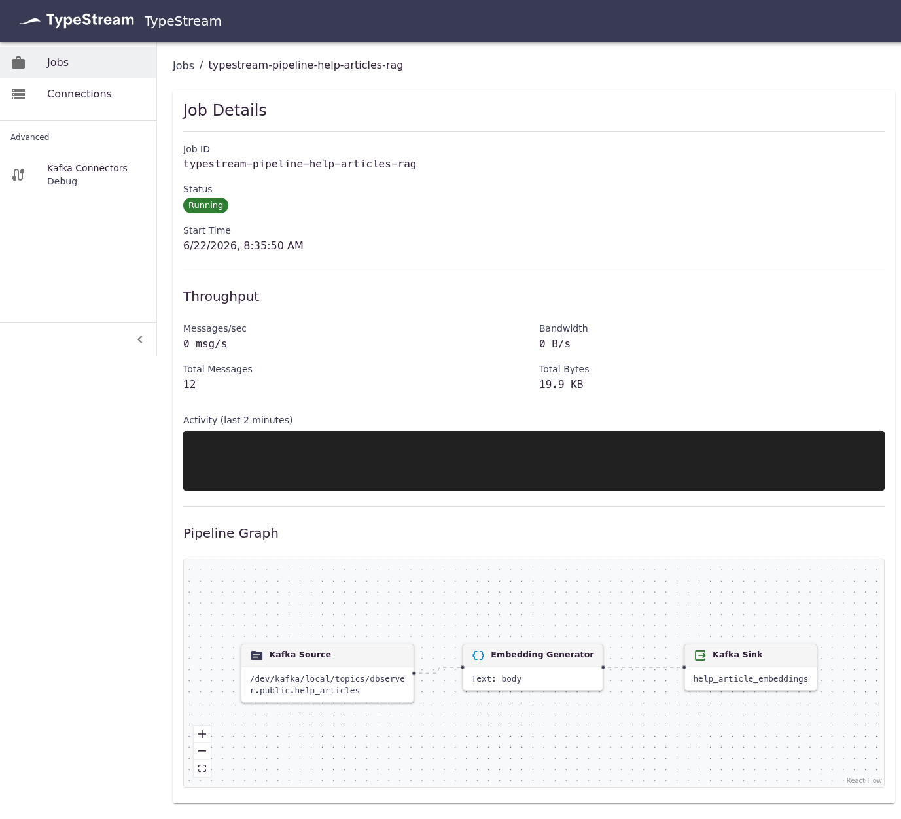

# Live RAG: Postgres → TypeStream → Qdrant

A self-contained demo of **continuously-fresh RAG**. A support chatbot answers from a
Qdrant collection of help-center docs. The source of truth is Postgres — and the moment a
row changes, TypeStream re-embeds it and the bot's answer changes seconds later. No
reindex job, no consumer code, no Kafka to operate.

> Data is fictional ("Northwind"). Nothing here is real.



## What's inside

```
Postgres(help_articles) --Debezium CDC--> Kafka --> TypeStream pipeline
   (kafkaSource unwrapCdc -> embeddingGenerator -> qdrantSink: help_articles)
   --> qdrant-kafka sink connector --> Qdrant(help_articles)
                                          ^ vector search
   chatbot (Node+Express) ----------------/   embed question -> top-3 -> grounded answer
```

The pipeline ends in a native `qdrantSink` node: TypeStream reshapes each record into
the envelope the [qdrant-kafka](https://github.com/qdrant/qdrant-kafka) connector expects
(`{collection_name, id, vector, payload}`) and registers the connector itself — the
pipeline file is the whole configuration.

The chatbot queries Qdrant directly; TypeStream's only job is keeping Qdrant fresh.

## Walkthrough

### 1. Start the stack

```bash
cp .env.example .env          # add your OPENAI_API_KEY
docker compose up             # wait until the `bootstrap` container prints "Demo is live."
```

`bootstrap` runs once: it registers the Postgres CDC connector, creates the Qdrant
collection, and applies the TypeStream pipeline (the server registers the Qdrant sink
connector as part of the apply), then exits. It waits for the server to be healthy first,
so a slow first boot is fine — there are no manual steps. When it prints **"Demo is live."**
everything is seeded. The pipeline is persisted in Kafka and auto-recovers on restart.

Three things are now running:

| URL | What |
|-----|------|
| **http://localhost:8000** | the support assistant (RAG chatbot) |
| **http://localhost:5173** | the TypeStream UI — the pipeline graph + live job status |
| **http://localhost:6333/dashboard** | Qdrant's own dashboard (browse the `help_articles` points) |

### 2. Look at the pipeline

The entire pipeline is one config-as-code file, **`pipeline/help-articles.typestream.json`**:

```json
{
  "name": "help-articles-rag",
  "graph": {
    "nodes": [
      { "id": "source-1", "kafkaSource": {
          "topicPath": "/dev/kafka/local/topics/dbserver.public.help_articles",
          "encoding": "AVRO", "unwrapCdc": true } },
      { "id": "embed-1", "embeddingGenerator": {
          "textField": "body", "outputField": "embedding",
          "model": "text-embedding-3-small" } },
      { "id": "sink-1", "qdrantSink": {
          "connectionId": "dev-qdrant", "collectionName": "help_articles",
          "idField": "id", "vectorField": "embedding",
          "payloadFields": "title,body,category" } }
    ],
    "edges": [
      { "fromId": "source-1", "toId": "embed-1" },
      { "fromId": "embed-1", "toId": "sink-1" }
    ]
  }
}
```

Read top to bottom: Postgres CDC (unwrapped) → OpenAI embedding → native `qdrantSink`.
That single file is the whole configuration — the server compiles it into a running Kafka
Streams job **and** the qdrant-kafka sink connector.

Prefer to see it running visually? Open the **TypeStream UI at http://localhost:5173** — the
applied pipeline shows up as a live graph with per-node throughput and job status.
(To render the native Qdrant node on the drag-and-drop canvas you need the UI image built
from this branch — see [Running against locally built images](#running-against-locally-built-images);
the published UI image still lists the running job either way.)

### 3. Ask the support assistant

Open **http://localhost:8000** and ask:

> **How long is the free trial?** → *"The free trial is 14 days."*

The answer is grounded in the `Free Trial` help-center doc — the source of truth is Postgres.

### 4. Change the source data, then ask again

Now change a row in Postgres. TypeStream picks up the change over CDC, re-embeds the row,
and Qdrant is fresh within seconds — no reindex job, no consumer code.

**UPDATE — flip a number in place:**

```bash
docker compose exec -T postgres psql -U typestream -d demo < demo/update-trial.sql
```

Ask the same question again → *"The free trial is 30 days."*

**INSERT — a topic that didn't exist yet:** first ask *"Do you support single sign-on / Okta?"*
→ *"I don't have that information."* Then insert the new doc:

```bash
docker compose exec -T postgres psql -U typestream -d demo < demo/insert-sso.sql
```

Ask again a few seconds later → the bot answers from the brand-new SSO doc.

> Answers are deterministic (temperature 0), so only *freshness* changes between asks —
> clean for a screen recording.

### 5. Start over with fresh data

The stack has no volumes — all state is ephemeral. `docker compose down` wipes everything
(Postgres rows, Qdrant points, Kafka offsets); the next `docker compose up` re-seeds a clean
baseline. (`docker compose stop`/`start` pauses **without** wiping.)

## Retargeting to another datastore

The reusable core (Postgres, CDC, redpanda, TypeStream server, `bootstrap.sh`, the chatbot
shell) is vendor-neutral. Only two files encode "Qdrant":

| File | What changes |
|------|--------------|
| `bootstrap/target.sh` | `create_collection` + connector/doc-count readiness checks |
| `chatbot/retriever.js` | how a question becomes documents (`retrieve(q, k) -> [{title, body}]`) |
| `docker-compose.yml` | swap the `qdrant` service block + the chatbot's `QDRANT_URL` |
| `pipeline/*.json` | swap the sink node (`qdrantSink` → your destination's sink) |

## Notes & limits

- Requires `OPENAI_API_KEY` (server embeds docs; chatbot embeds queries + generates answers).
- Embedding model is pinned to `text-embedding-3-small` on both sides — keep them in sync.
  The Qdrant collection is created with the matching vector size (1536, Cosine).
- **Deletes are out of scope** here (insert + update only). The upstream CDC unwrap drops
  delete events, and `qdrant-kafka` currently skips tombstones
  ([qdrant-kafka#8](https://github.com/qdrant/qdrant-kafka/issues/8)), so removing ghost
  vectors on delete is a separate, more advanced beat.
- The auto-generated intermediate topic carries **schemaless JSON**, not Avro: `qdrant-kafka`
  Jackson-serializes the record value and cannot handle Connect Structs, so schemaless JSON
  is its only working input format. The topic is an internal buffer (one producer, one
  consumer) — don't treat it as a public contract. Pipeline-level typing is unaffected:
  the `qdrantSink` node validates id/vector/payload fields at apply time.
- Connector version is pinned to `qdrant-kafka` **1.3.1**: v1.3.2/v1.3.3 ship a packaging
  regression (the shaded gRPC `NameResolverProvider` service file lost its DNS entry) that
  breaks any `host:port` connection with a `unix:///` resolver error.
- First `docker compose up` pulls/builds images; pre-warm once before recording.

## Running against locally built images

Until a TypeStream release ships the `qdrantSink` node and the bundled qdrant-kafka
connector, build the server and kafka-connect images from this repo and point compose
at them:

```bash
# from the repo root (both commands tag the images as :latest, which compose uses by default)
docker build -f docker/Dockerfile.kafka-connect -t ghcr.io/typestreamio/kafka-connect:latest .
./gradlew server:jibDockerBuild

# then, in this directory
docker compose up
```
